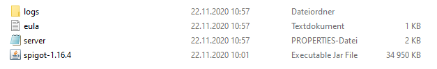
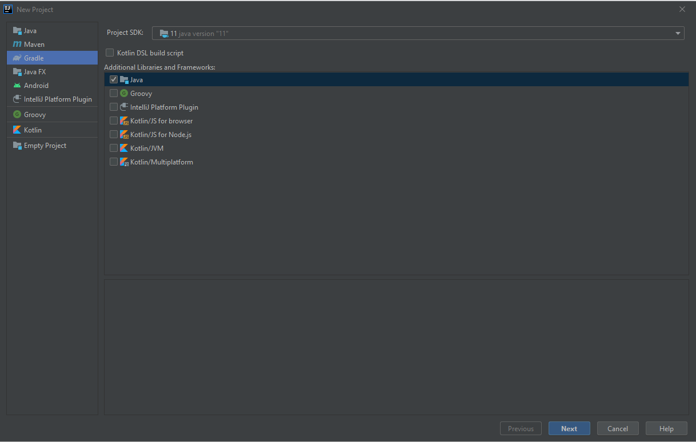

# Coderdojo Workshops: Minecraft Material Detector

In diesen Workshops programmieren wir ein Java Plugin für Minecraft. Dabei starten wir ganz einfach damit, den Spieler 
auf Kommando zu begrüßen und werden in weiterer Folge einen "Material-Detektor" bauen. Dieser soll ähnlich wie ein 
Metalldetektor funktionieren und einen Ton abspielen, wenn ein bestimmter Block (z.B. ein Diamant) in der Nähe ist
. [In diesem Video](https://youtu.be/EDVATLCACEM) siehst du, wie das dann in etwa aussehen soll.

[](https://www.youtube.com/watch?v=EDVATLCACEM)

In dieser Datei steht, wie du das Plugin vom letzten Workshop ausführen kannst. Scrolle ganz nach unten, um zu den detaillierten Anleitungen für die ersten 3 Teile zu gelangen. Klicke dort auf die Überschriften um den Code und der jeweiligen Anleitung zu sehen.

## Anleitung: Plugin ausführen
Diese Anleitung beschreibt, wie du einen lokalen Minecraft Server starten und das neueste Plugin aus dem Workshop darauf ausführen kannst. Diesen Teil musst du abschließen um am Workshop teilzunehmen.

Wenn du Hilfe brauchst, kannst du jederzeit am [CoderDojo Discord Server](https://discord.gg/FFp9gC4) im Java Channel fragen stellen oder mir direkt schreiben (Kathi#7997).

## Voraussetzungen
- Eine offizielle Installation von Minecraft (Java Version) mit Version 1.16.4 oder höher
- [IntelliJ IDEA Community Edition](https://www.jetbrains.com/idea/download/) mit Version 2020.2.3 oder höher

## Anleitung

1. Erstelle einen neuen Ordner. Ich habe meinen zum Beispiel `minecraft-server` genannt.
2. Lade die Datei `spigot-1.16.5.jar` herunter und speichere sie in deinem neuen Ordner.
3. Mach einen Doppelklick auf die Datei `spigot-1.16.5.jar` um sie auszuführen. Das kann ein paar Sekunden dauern. Danach sollte es in deinem Ordner so aussehen: 



4. Öffne nun die Datei `eula.txt` und ändere die Zeile `eula=false` auf `eula=true` um dem Endebenutzer-Lizenzvertrag
 zuzustimmen.
5. Mach einen Doppelklick auf die Datei `spigot-1.16.5.jar` um sie auszuführen. Das kann wieder ein bisschen dauern. Danach sollte ein neues Fenster aufgehen, indem der Server ausgeführt wird. Der Server läuft, wenn in der letzten Zeile des Fensters `[11:04:02 INFO]: Done (20.386s)! For help, type "help"` steht. Die Zahl in der Klammer kann  dabei abweichen.
6. Öffnne nun Minecraft und klicke auf "Mehrspieler" -> "Server hinzufügen" und gib "localhost" als Serveradresse ein. Klicke danach auf "Fertig".
7. Nun kannst du deinen Server in der Liste auswählen und darauf spielen.
8. Öffne nun IntelliJ IDEA und klicke auf "New Project".
9. Wähle links in der Liste "Gradle" mit einem Klick aus. 
10. Setze die Project SDK auf 1.8 (oder 11, wenn du auf deinem Computer Java 11 installiert hast) und wähle bei "Additional Libraries and Frameworks" "Java" mit einem Klick aus. Das sollte dann in etwa so wie unten im Bild aussehen.
 


11. Klicke auf "Next".
12. Gib den Namen deines Projektes bei "Name:" ein. Ich habe hier "MaterialDetector" eingegeben. Klicke dann auf "Finish".
13. Öffne die Datei `build.gradle` und füge den folgenden Code ein.
```
plugins {
    id 'java'
}

group 'org.example'
version '1.0-SNAPSHOT'

repositories {
    mavenCentral()
    maven {
        url "https://hub.spigotmc.org/nexus/content/repositories/public/"
    }
}

dependencies {
    implementation group: 'org.bukkit', name: 'bukkit', version: '1.15.2-R0.1-SNAPSHOT'
    testCompile group: 'junit', name: 'junit', version: '4.12'
}

task('deploy', dependsOn: jar, type: Copy) {
    from jar into ""
}
```
14. Öffne nun den Ordner in dem dein Server läuft (in dieser Anleitung haben wir ihn "minecraft-server" genannt) und öffne darin den Ordner "plugins".
15. Klicke oben im File Explorer in die Addressleiste und kopiere den Pfad des "plugins" Ordner.
16. Füge den Pfad zwischen die zwei Anführungszeichen in der Zeile `from jar into ""` ein. Bei mir sieht das dann zum Beispiel so aus:
´´´
task('deploy', dependsOn: jar, type: Copy) {
    from jar into "C:\\Users\\Kathi\\Desktop\\coderdojo\\workshops\\2020-11-20_minecraft-material-detector\\minecraft-server\\plugins"
}
´´´
17. Mache einen Rechtsklick auf den Ordner `src/main/java` und klicke auf "New" -> "Java Class" um eine neue Java
 Klasse zu erstellen.
18. Gib den Namen "MaterialDetector" ein und drücke auf Enter.
19. Füge den folgenden Code in die neue Klasse ein. Was es damit auf sich hat, kannst du [in dieser Übungsanleitung](https://linz.coderdojo.net/uebungsanleitungen/programmieren/minecraft/plugins/erstes-plugin/#die-klasse-programmieren) nachlesen.
```java
import detectors.Detector;
import listeners.PlayerEventListener;
import org.bukkit.Material;
import org.bukkit.command.Command;
import org.bukkit.command.CommandSender;
import org.bukkit.plugin.java.JavaPlugin;

import java.util.HashMap;
import java.util.Map;


public class MaterialDetector extends JavaPlugin {

    @Override
    public void onEnable() {
        super.onEnable();

        Map<Integer, Detector> detectors = new HashMap<>();

        Detector diamondCoalDetector = new Detector("Diamant", "Kohle", "Spitzhacke", Material.COAL_ORE, Material.COAL, Material.DIAMOND_PICKAXE);
        diamondCoalDetector.addCraftingRecipe(this);
        detectors.put(diamondCoalDetector.getId(), diamondCoalDetector);

        Detector woodenCoalDetector = new Detector("Holz", "Kohle", "Spitzhacke", Material.COAL_ORE, Material.COAL, Material.WOODEN_PICKAXE);
        woodenCoalDetector.addCraftingRecipe(this);
        detectors.put(woodenCoalDetector.getId(), woodenCoalDetector);

        getServer().getPluginManager().registerEvents(new PlayerEventListener(detectors), this);
    }

    @Override
    public boolean onCommand(CommandSender sender, Command command, String label, String[] args) {
        if (command.getName().equals("sayhello")) {
            sender.sendMessage("Hallo " + sender.getName());
        }
        return super.onCommand(sender, command, label, args);
    }
}
```
17. Mache einen Rechtsklick auf den Ordner `src/main/java` und klicke auf "New" -> "Package" um ein neues Package zu erstellen. Gib den Namen `detectors` ein und drücke auf Enter.
18. Mache einen Rechtsklick auf den Ordner `src/main/java` und klicke auf "New" -> "Package" um ein neues Package zu erstellen. Gib den Namen `listeners` ein und drücke auf Enter.
19. Mache einen Rechtsklick auf das neue Package `listeners` und klicke auf "New" -> "Java Class". Gib den Namen "PlayerEventListener" ein und drücke auf Enter.
20. Füge den folgenden Code in die neue Klasse ein.
```java
package listeners;

import detectors.Detector;
import org.bukkit.Location;
import org.bukkit.Sound;
import org.bukkit.block.Block;
import org.bukkit.entity.Player;
import org.bukkit.event.EventHandler;
import org.bukkit.event.Listener;
import org.bukkit.event.player.PlayerJoinEvent;
import org.bukkit.event.player.PlayerMoveEvent;
import org.bukkit.inventory.ItemStack;
import org.bukkit.inventory.meta.ItemMeta;

import java.util.Map;

public class PlayerEventListener implements Listener {

    private final Map<Integer, Detector> detectors;

    public PlayerEventListener(Map<Integer, Detector> detectors) {
        this.detectors = detectors;
    }

    @EventHandler
    public void onPlayerJoin(PlayerJoinEvent event) {
        Player player = event.getPlayer();
        player.sendMessage("Hallo " + player.getName());

        detectors.forEach((id, detector) -> {
            player.discoverRecipe(detector.getKey());
        });
    }

    @EventHandler
    public void onPlayerMove(PlayerMoveEvent event) {
        Player player = event.getPlayer();
        ItemStack itemInMainHand = player.getInventory().getItemInMainHand();

        if (!itemInMainHand.hasItemMeta()) {
            return;
        }

        ItemMeta meta = itemInMainHand.getItemMeta();
        if (meta == null || !meta.hasCustomModelData()) {
            return;
        }

        Detector detector = detectors.get(meta.getCustomModelData());
        if (detector == null) {
            return;
        }

        Block targetBlock = player.getTargetBlock(null, 5);
        Location targetLocation = targetBlock.getLocation();
        if (detector.isMaterialBelowLocation(player.getWorld(), targetLocation)) {
            player.playSound(player.getLocation(), Sound.BLOCK_NOTE_BLOCK_CHIME, 1, 2);
        } else if (detector.isMaterialInRange(player.getWorld(), targetLocation)) {
            player.playSound(player.getLocation(), Sound.BLOCK_NOTE_BLOCK_CHIME, 0.5F, 1);
        }
    }
}
```
19. Mache einen Rechtsklick auf das neue Package `detectors` und klicke auf "New" -> "Java Class". Gib den Namen "Detector" ein und drücke auf Enter.
20. Füge den folgenden Code in die neue Klasse ein.
```java
package detectors;

import org.bukkit.*;
import org.bukkit.block.Block;
import org.bukkit.enchantments.Enchantment;
import org.bukkit.inventory.ItemStack;
import org.bukkit.inventory.ShapedRecipe;
import org.bukkit.inventory.meta.ItemMeta;
import org.bukkit.plugin.Plugin;

public class Detector {

    private final String name;
    private final int id;

    private final Material materialToDetect;
    private final Material craftingMaterial;
    private final Material baseMaterial;

    private NamespacedKey recipeKey;

    public Detector(String namePrefix, String nameOfMaterialToDetect, String nameOfBaseMaterial,
                    Material materialToDetect, Material craftingMaterial, Material baseMaterial) {
        name = namePrefix + " " + nameOfMaterialToDetect + " Detektor " + nameOfBaseMaterial;
        id = name.hashCode();

        this.materialToDetect = materialToDetect;
        this.craftingMaterial = craftingMaterial;
        this.baseMaterial = baseMaterial;
    }

    public NamespacedKey getKey() {
        return recipeKey;
    }

    public int getId() {
        return id;
    }

    public void addCraftingRecipe(Plugin plugin) {
        // Create result
        ItemStack detector = new ItemStack(baseMaterial);

        ItemMeta detectorMeta = detector.getItemMeta();
        detectorMeta.setDisplayName(name);
        detectorMeta.setCustomModelData(id);
        detector.setItemMeta(detectorMeta);

        detector.addEnchantment(Enchantment.DURABILITY, 3);
        detector.addEnchantment(Enchantment.VANISHING_CURSE, 1);

        // Create recipe
        recipeKey = new NamespacedKey(plugin, name.toLowerCase().replaceAll("\\s", "-"));
        ShapedRecipe recipe = new ShapedRecipe(recipeKey, detector);

        recipe.shape(
                "C  ",
                " B ",
                "MMM"
        );

        recipe.setIngredient('C', Material.COMPASS);
        recipe.setIngredient('B', baseMaterial);
        recipe.setIngredient('M', craftingMaterial);

        Bukkit.addRecipe(recipe);
    }

    public boolean isMaterialBelowLocation(World world, Location location) {
        for(int y = 0; y < 10; y++) {
            Block targetBlock = world.getBlockAt(location.getBlockX(), location.getBlockY() - y, location.getBlockZ());
            if (targetBlock.getType() == materialToDetect) {
                return true;
            }
        }
        return false;
    }

    public boolean isMaterialInRange(World world, Location location) {
        for(int x = location.getBlockX() - 1; x <= location.getBlockX() + 1; x++) {
            for(int z = location.getBlockZ() - 1; z <= location.getBlockZ() + 1; z++) {
                if (isMaterialBelowLocation(world, new Location(world, x, location.getBlockY(), z))) {
                    return true;
                }
            }
        }
        return false;
    }
}
```
19. Mache einen Rechtsklick auf das neue Package `detectors` und klicke auf "New" -> "Java Class". Gib den Namen "DiamondDetector" ein und drücke auf Enter.
20. Füge den folgenden Code in die neue Klasse ein.
```java
package detectors;

import org.bukkit.Material;

public class DiamondDetector extends Detector {

    public DiamondDetector(String nameOfMaterialToDetect, Material materialToDetect, Material craftingMaterial) {
        super("Diamant", nameOfMaterialToDetect, "Spitzhacke", materialToDetect, craftingMaterial, Material.DIAMOND_PICKAXE);
    }
}
```
21. Mache nun einen Rechtsklick auf den Ordner `src/main/resources` und klicke auf "New" -> "File". Gib den Namen "plugin.yml" ein und drücke auf Enter.
22. Füge den folgenden Code in die neue Datei ein. Details dazu kannst du wieder [in dieser Übungsanleitung](https://linz.coderdojo.net/uebungsanleitungen/programmieren/minecraft/plugins/erstes-plugin/#das-plugin-yml-anlegen-das-projekt-bauen-und-testen) nachlesen.
```yml
name: MaterialDetector
main: MaterialDetector
version: 0.1
api-version: 1.16
commands:
  sayhello:
    description: Sagt Hallo
    usage: /sayhello
```
23. Klicke in der rechten Sidebar von IntelliJ IDEA auf "Gradle".
24. Öffne dein Projekt mit einem Doppelklick auf deinen Projektnamen (in meinem Fall "MaterialDetector"). 
25. Klicke nun auf "Tasks" und dann auf "other". Klicke nun auf "deploy", um eine JAR Datei zu erstellen, die deinen Code beinhaltet. Diese wird dann automatisch in den "plugins" Ordner von deinem Server kopiert.
26. Falls dein Server nicht mehr läuft, starte ihn. 
27. Gib im Fenster, in dem der Server läuft, das Kommando `rl` (reload) ein, um das Plugin zu laden.
28. Wenn du nun Minecraft öffnest und dich zu deinem Server verbindest, kannst du nun das Kommando "/sayhello" eingeben. Der Server wird dich dann begrüßen :) Außerdem solltest du in deinem Rezeptbuch Rezepte für unsere Detektoren sehen.


## [1. Termin | 20.11.2020](https://github.com/KatharinaSick/coderdojo-minecraft-material-detector/tree/2020-11-20_first-workshop)
Bei diesem Workshop haben wir uns darauf konzentriert, dass alle auf ihrem lokalen Minecraft Server spielen können und haben danach ein kleines Plugin geschrieben, welches den Spieler auf Kommando begrüßt. Unten findest du eine kurze Übersicht der Dinge, die wir im Workshop besprochen haben. Den Code für diesen Workshop findest du auf dem Branch [2020-11-20_first-workshop](https://github.com/KatharinaSick/coderdojo-minecraft-material-detector/tree/2020-11-20_first-workshop).

## [2. Termin Anfänger | 10.12.2020](https://github.com/KatharinaSick/coderdojo-minecraft-material-detector/tree/2020-12-11_second-workshop-beginners)
Bei diesem Workshop haben wir einen sogenannten EventListener hinzugefügt, um den Spieler nicht nur auf Kommando zu begrüßen, sondern sofort wenn er auf den Server kommt. Als nächstes haben wir ein eigenes Rezept für eine Diamant Spitzhhacke, die später Kohle detektieren soll, hinzugefügt. Den Code für diesen Workshop findest du auf dem Branch [2020-12-11_second-workshop-beginners](https://github.com/KatharinaSick/coderdojo-minecraft-material-detector/tree/2020-12-11_second-workshop-beginners).

## [2. Termin Fortgeschrittene | 15.12.2020](https://github.com/KatharinaSick/coderdojo-minecraft-material-detector/tree/2020-12-15_second-workshop-advanced)
Bei diesem Workshop haben wir einen sogenannten EventListener hinzugefügt, um den Spieler nicht nur auf Kommando zu begrüßen, sondern sofort wenn er auf den Server kommt. Als nächstes haben wir ein eigenes Rezept für eine Diamant Spitzhhacke, die später Kohle detektieren soll, hinzugefügt und unseren EventListener dann so erweitert, dass ein Ton abgespielt wird, sobald der Spieler auf einen Block zeigt, unter dem sich Kohle befindet. Den Code für diesen Workshop findest du auf dem Branch [2020-12-15_second-workshop-advanced](https://github.com/KatharinaSick/coderdojo-minecraft-material-detector/tree/2020-12-15_second-workshop-advanced).

## [3. Termin | 18.12.2020](https://github.com/KatharinaSick/coderdojo-minecraft-material-detector/tree/2020-12-18_third-workshop)
Bei diesem Workshop haben wir unseren Kohledetektor so angepasst, dass nicht nur Blöcke unter dem aktuellen Block sondern auch die umliegenden Blöcke überprüft werden. Den Code für diesen Workshop findest du auf dem Branch [2020-12-18_third-workshop](https://github.com/KatharinaSick/coderdojo-minecraft-material-detector/tree/2020-12-18_third-workshop).
