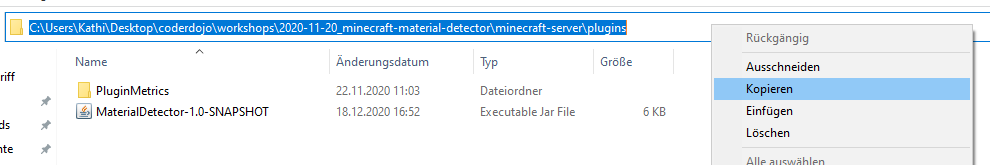

## Zusammenfassung 2. Termin Fortgeschrittene | 15.12.2020

Bei diesem Workshop haben wir einen sogenannten EventListener hinzugefügt, um den Spieler nicht nur auf Kommando zu begrüßen, sondern sofort wenn er auf den Server kommt. Als nächstes haben wir ein eigenes Rezept für eine Diamant Spitzhhacke, die später Kohle detektieren soll, hinzugefügt und unseren EventListener dann so erweitert, dass ein Ton abgespielt wird, sobald der Spieler auf einen Block zeigt, unter dem sich Kohle befindet.
 
## Voraussetzungen
- Den Code vom [1. Termin des Workshops](#zusammenfassung-1-termin--20112020) ausführen können.

## Anleitung

1. Öffne die Datei `MaterialDetector` und ersetze die komplette `onCommand(..)` Methode mit dem folgenden Code. Somit können Kommandos sicherer und besser erkannt werden.
```java
@Override
public boolean onCommand(CommandSender sender, Command command, String label, String[] args) {
    if (command.getName().equals("sayhello")) {
        sender.sendMessage("Hallo " + sender.getName());
    }
    return super.onCommand(sender, command, label, args);
}
```
2. Mache einen Rechtsklick auf den Ordner `src/main/java` und klicke auf "New" -> "Package" um ein neues Package zu erstellen. Gib den Namen "listeners" ein und dürcke auf Enter.
3. Mache einen Rechtsklick auf das neue Package `listeners`und klicke auf "New" -> "Java Class" um eine neue Java
 Klasse zu erstellen. Gib den Namen "PlayerEventListener" ein und drücke auf Enter.
4. Füge den folgenden Code ein. Die jeweiligen Zeilen sind in den Kommentaren erklärt.
```java
// Hier importieren wir die Klassen, die wir unten im Code verwenden. Würden wir das nicht machen, müsste man statt z.B. "Player" immer "org.bukkit.entity.Player" schreiben, damit unsere Klasse weiss, welcher Player gemeint ist
import org.bukkit.entity.Player;
import org.bukkit.event.EventHandler;
import org.bukkit.event.Listener;
import org.bukkit.event.player.PlayerJoinEvent;

// Die Definition der Klasse:
// - Die Klasse ist "public" -> Für alle anderen Klassen sichtbar
// - Ihr Name ist "PlayerEventListener"
// - Die Klasse implementiert das Interface Listener. Vereinfacht gesagt, bestimmen wir so, dass unsere Klasse auch ein "Listener" ist. Falls das Interface Methoden enthalten würde, müssten wir diese überschreiben.
public class PlayerEventListener implements Listener {

    // Eine sogenannte "Annotation", die die unten stehende Methode als EventHandler (mit der Priorität NORMAL) markiert.
    @EventHandler
    // Die Definition der Methode
    // - Sie ist "public" -> für alle sichtbar
    // - Ihr Name ist "onPlayerJoin"
    // - Sie hat ein Argument vom Typ PlayerJoinEvent namens event
    public void onPlayerJoin(PlayerJoinEvent event) {
        // Hier speichern wir den Spieler, durch den das Event ausgelöst wurde in der Variable player
        Player player = event.getPlayer();
        // Hier schicken wir die Begrüßungsnachricht an den Spieler
        player.sendMessage("Hallo " + player.getName());
    }
}
```
4. Nun müssen wir unseren neuen `EventListener` noch registrieren, damit Bukkit weiß, dass es ihn gibt. Wechsle dazu wieder zu deiner `MaterialDetector` Klasse und füge die folgende Zeile in die `onEnable()` Methode ein.
```java
getServer().getPluginManager().registerEvents(new PlayerEventListener(), this);
```
5. Öffne den Ordner, in dem du deinen Server startest (also den, in dem die Datei `spigot-1.16.4.jar` liegt und öffne darin den Ordner `plugins`.
6. Klicke im Explorer oben in die Addressleiste und kopiere die Addresse des `plugins` Ordners (siehe Bild).



7. Öffne die Datei `build.gradle` und füge den folgenden Code ganz unten in der Datei ein. Ersetze dabei `<PFAD>` durch den Pfad, den du soeben kopiert hast.
```
task('deploy', dependsOn: jar, type: Copy) {
    from jar into "<PFAD>"
}
```
8. Klicke in der rechten Sidebar von IntelliJ IDEA auf "Gradle".
9. Öffne dein Projekt mit einem Doppelklick auf deinen Projektnamen (in meinem Fall "MaterialDetector") und klicke auf "Tasks" -> "other" -> "deploy". Mit diesem Task (den wir vorher erstellt haben) wird die JAR Datei nun generiert und automatisch ins `plugins` Verzeichnis deines Servers kopiert. 
10. Wenn dein Server schon läuft, gib `rl` in der Konsole des Servers ein, um das Plugin neu zu laden. Falls er noch nicht läuft, starte den Server einfach.
11. Erstelle ein neues Package namens `detectors`.
12. Erstelle im Package `detectors` eine neue Klasse namens `Detector`.
13. Füge den folgenden Code ein. Die jeweiligen Zeilen sind in den Kommentaren erklärt.
```java
package detectors;

// Hier importieren wir die Klassen, die wir unten im Code verwenden. Würden wir das nicht machen, müsste man statt z.B. "Location" immer "org.bukkit.Location" schreiben, damit unsere Klasse weiss, welche Location Klasse gemeint ist
import org.bukkit.Bukkit;
import org.bukkit.Location;
import org.bukkit.Material;
import org.bukkit.NamespacedKey;
import org.bukkit.World;
import org.bukkit.block.Block;
import org.bukkit.enchantments.Enchantment;
import org.bukkit.inventory.ItemStack;
import org.bukkit.inventory.ShapedRecipe;
import org.bukkit.inventory.meta.ItemMeta;
import org.bukkit.plugin.Plugin;

// Die Definition der Klasse:
// - Die Klasse ist "public" -> für alle sichtbar
// - Ihr Name ist "Detector"
public class Detector {

    // Hier initialisieren wir Variablen, die wir später brauchen werden
    private final String name;
    private final int id;

    private final Material materialToDetect;
    private final Material craftingMaterial;

    private NamespacedKey recipeKey;

    // Der Konstruktor der Klasse, dieser wird verwendet, um eine neue Instanz der Klasse zu erstellen
    public Detector() {
        // Hier weisen wir den Variablen, die wir oben erstellt haben, Werte zu
        name = "Diamant Kohle Detektor Spitzhacke";
        id = name.hashCode();

        materialToDetect = Material.COAL_ORE;
        craftingMaterial = Material.COAL;
    }

    // Zwei sogenannte "Getter" um auf private Variablen zugreifen zu können
    public NamespacedKey getKey() {
        return recipeKey;
    }

    public int getId() {
        return id;
    }

    // Diese Methode wird aufgerufen, wenn das Crafting Rezept für den Detektor zu Bukkit hinzugefügt werden soll
    // - "public" -> für alle sichtbar
    // - "void" -> sie gibt nichts zurück
    // - name = addCraftingRecipe
    // - parameter: eine Variable namens plugin vom Typ Plugin
    public void addCraftingRecipe(Plugin plugin) {
        // Ab hier definieren wir, wie das Ergebnis aussehen soll -> eine verzauberte Diamant Spitzhacke mit dem Namen "Kohle Detektor" und der ID 258. Diese ID könnte jede Zahl sein, du musst sie dir nur merken.
        ItemStack detector = new ItemStack(Material.DIAMOND_PICKAXE);

        ItemMeta detectorMeta = detector.getItemMeta();
        detectorMeta.setDisplayName(name);
        detectorMeta.setCustomModelData(id);
        detector.setItemMeta(detectorMeta);

        detector.addEnchantment(Enchantment.DURABILITY, 3);
        detector.addEnchantment(Enchantment.VANISHING_CURSE, 1);

        // Ab hier definieren wir das Rezept selbst
        recipeKey = new NamespacedKey(plugin, name.toLowerCase().replaceAll("\\s", "-"));
        ShapedRecipe recipe = new ShapedRecipe(recipeKey, detector);

        // Die Form des Rezeptes -> wie man die Zutaten auf der Werkbank anordnen muss. In diesem Fall: links oben ein "C", in der Mitte ein "P" und in der unteren Reihe 3 "K"
        recipe.shape(
                "C  ",
                " P ",
                "MMM"
        );

        // Hier definieren wir, dass "C", "P" und "M" in unserem Rezept bedeuten. Also Kompass, Spitzhacke und Kohle.
        recipe.setIngredient('C', Material.COMPASS);
        recipe.setIngredient('P', Material.DIAMOND_PICKAXE);
        recipe.setIngredient('M', craftingMaterial);

        // Als letzten Schritt fügen wir das Rezept zu Bukkit hinzu.
        Bukkit.addRecipe(recipe);
    }

    // Diese Methode überprüft, ob sich das Material nach dem wir suchen (Kohle) unter der Location befindet, die hier übergeben wird.
    public boolean isMaterialBelowLocation(World world, Location location) {
        // Eine for-Schleife. Sie wird 10 mal durchlaufen. Beim ersten Durhclauf hat y den Wert 0, beim 2. 1, beim 3. 2 und so weiter.
        for (int y = 0; y < 10; y++) {
            // Der Block an der übergebenen Location
            Block targetBlock = world.getBlockAt(location.getBlockX(), location.getBlockY() - y, location.getBlockZ());
            // Wenn der Block vom Typ ist, den wir suchen (Kohle), geben wir "true" zurück
            if (targetBlock.getType() == materialToDetect) {
                return true;
            }
        }
        // Wenn das Material nicht gefunden wurde, geben wir "false" zurück.
        return false;
    }
}
```
14. Wechsle nun wieder zur Klasse `MaterialDetector` und füge den folgenden Code in die `onEnable(..)` Methode ein, um den `Detector` zu erstellen und die Methode aufzurufen, die das Rezept zu Bukkit hinzufügt. 
```java
Detector detector = new Detector();
detector.addCraftingRecipe(this);
```
15. Nun haben wir das Rezept erstellt, müssen es aber noch zum Rezeptbuch des Spielers hinzufügen. Das erledigen wir, sofort nachdem der Spieler sich mit dem Server verbindet. Öffne dazu die Klasse `PlayerEventListener` und erstelle eine neue Member-Variable `private Detector detector;` und einen Konstruktor, dem diese Variable übergeben wird. Füge dazu diese Zeilen oben in deiner Klasse ein.
```java
private Detector detector;

public PlayerEventListener(Detector detector) {
    this.detector = detector;
}
```
16. Jetzt kannst, du dem Spieler das Rezept geben, sobald er sich mit dem Server verbindet. Füge dazu die Zeile `player.discoverRecipe(detector.getKey());` unten in der `onPlayerJoin(..)` Methode ein. Deine Klasse sollte nun so aussehen:
```java
package listeners;

import detectors.Detector;
import org.bukkit.Location;
import org.bukkit.Sound;
import org.bukkit.block.Block;
import org.bukkit.entity.Player;
import org.bukkit.event.EventHandler;
import org.bukkit.event.Listener;
import org.bukkit.event.player.PlayerJoinEvent;
import org.bukkit.event.player.PlayerMoveEvent;
import org.bukkit.inventory.ItemStack;
import org.bukkit.inventory.meta.ItemMeta;

public class PlayerEventListener implements Listener {

    private Detector detector;

    public PlayerEventListener(Detector detector) {
        this.detector = detector;
    }

    @EventHandler
    public void onPlayerJoin(PlayerJoinEvent event) {
        Player player = event.getPlayer();
        player.sendMessage("Hallo " + player.getName());

        player.discoverRecipe(detector.getKey());
    }
}
```
17. Führe nun das Plugin aus (siehe Punkte 8 - 10) und überprüfe, ob du den Kohledetektor im Rezeptbuch siehst.
18. Jetzt können wir uns den Detektor zusammenbauen, aber es passiert noch nichts, wenn wir ihn halten. Deshalb müssen wir nun den `PlayerEventListener` erweitern, um jedes Mal wenn sich der Spieler bewegt, zu überprüfen, ob der den Detektor in der Hand hält. Wenn er den Detektor in der Hand hält, muss zusätzlich überprüft werden, ob sich das gesuchte Material (Kohle) unter dem aktuellen Block befindet. Füge dazu die folgedende Methode unten im `PlayerEventListener` ein.
```java
// Eine EventHandler Methode, die ausgeführt wird, wenn sich der Spieler bewegt
@EventHandler
public void onPlayerMove(PlayerMoveEvent event) {
    // Hier speichern wir den Spieler, durch den das Event ausgelöst wurde in der Variable player
    Player player = event.getPlayer();
    // Hier speichern wir das Item, dass der Spieler in der Haupthand hat, in der Variable itemInMainHand
    ItemStack itemInMainHand = player.getInventory().getItemInMainHand();

    if (!itemInMainHand.hasItemMeta()) {
        // Wenn das item keine Metadaten hat, brechen wir die Methode ab, weil ein Detektor immer Metadaten hat
        return;
    }

    ItemMeta meta = itemInMainHand.getItemMeta();
    if (meta == null || !meta.hasCustomModelData() || meta.getCustomModelData() != detector.getId()) {
        // Wenn die Metadaten null sind oder das Item die falsche ID hat, brechen wir die Methode ab, weil es kein Detector ist
        return;
    }

    // Hier können wir sicher sein, dass der Spieler einen Detector in der Hand hat
    
    // Der Block auf den der Spieler zeigt
    Block targetBlock = player.getTargetBlock(null, 5);
    // Die Location des Blocks
    Location targetLocation = targetBlock.getLocation();
    
    // Hier rufen wir eine Methode im Detector auf und überprüfen, ob sich das gescuhte Material (Kohle) unter dem aktuellen Block befindet. 
    if (detector.isMaterialBelowLocation(player.getWorld(), targetLocation)) {
        // Wenn ja, spielen wir einen Ton ab.
        player.playSound(player.getLocation(), Sound.BLOCK_NOTE_BLOCK_CHIME, 1, 1);
    }
}
```

Das wars für diesen Workshop :)
