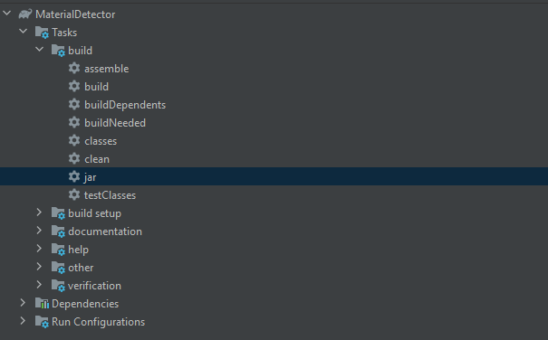

# Coderdojo Workshops: Minecraft Material Detector

In diesen Workshops programmieren wir ein Java Plugin für Minecraft. Dabei starten wir ganz einfach damit, den Spieler auf Kommando zu begrüßen und werden in weiterer Folge einen "Material-Detektor" bauen. Dieser soll ähnlich wie ein Metalldetektor funktionieren und einen Ton abspielen, wenn ein bestimmter Block (z.B. ein Diamant) in der Nähe ist. [In diesem Video](https://youtu.be/EDVATLCACEM) siehst du, wie das dann in etwa aussehen soll.

[](https://www.youtube.com/watch?v=EDVATLCACEM)

## Inhaltsverzeichnis

- [Zusammenfassung 1. Termin | 20.11.2020](#zusammenfassung-1-termin--20112020)
- [Zusammenfassung 2. Termin Anfänger | 10.12.2020](#zusammenfassung-2-termin-anfänger--10122020)

## Zusammenfassung 1. Termin | 20.11.2020

Bei diesem Workshop haben wir uns darauf konzentriert, dass alle auf ihrem lokalen Minecraft Server spielen können und haben danach ein kleines Plugin geschrieben, welches den Spieler auf Kommando begrüßt. Unten findest du eine kurze Übersicht der Dinge, die wir im Workshop besprochen haben. Den Code für diesen Workshop findest du auf dem Branch [2020-11-20_first-workshop](https://github.com/KatharinaSick/coderdojo-minecraft-material-detector/tree/2020-11-20_first-workshop).
 
## Voraussetzungen
- Eine offizielle Installation von Minecraft (Java Version) mit Version 1.16.4
- [IntelliJ IDEA Community Edition](https://www.jetbrains.com/idea/download/) mit Version 2020.2.3
- Java 11

## Anleitung

1. Erstelle einen neuen Ordner. Ich habe meinen zum Beispiel `minecraft-server` genannt.
2. Lade die Datei `spigot-1.16.4.jar` herunter und speichere sie in deinem neuen Ordner.
3. Mach einen Doppelklick auf die Datei `spigot-1.16.4.jar` um sie auszuführen. Das kann ein paar Sekunden dauern
. Danach sollte es in deinem Ordner so aussehen: 


4. Öffne nun die Datei `eula.txt` und ändere die Zeile `eula=false` auf `eula=true` um dem Endebenutzer-Lizenzvertrag
 zuzustimmen.
5. Mach einen Doppelklick auf die Datei `spigot-1.16.4.jar` um sie auszuführen. Das kann wieder ein bisschen dauern
. Danach sollte ein neues Fenster aufgehen, indem der Server ausgeführt wird. Der Server läuft, wenn in der letzten
 Zeile des Fensters `[11:04:02 INFO]: Done (20.386s)! For help, type "help"` steht. Die Zahl in der Klammer kann
  dabei abweichen.
6. Öffnne nun Minecraft und klicke auf "Mehrspieler" -> "Server hinzufügen" und gib "localhost" als Serveradresse ein
. Klicke danach auf "Fertig".
7. Nun kannst du deinen Server in der Liste auswählen und darauf spielen.
8. Öffne nun IntelliJ IDEA und klicke auf "New Project".
9. Wähle links in der Liste "Gradle" mit einem Klick aus. 
10. Setze die Project SDK auf 11 und wähle bei "Additional Libraries and Frameworks" "Java" mit einem Klick aus. Das
 sollte dann in etwa so wie unten im Bild aussehen.
 


11. Klicke auf "Next".
12. Gib den Namen deines Projektes bei "Name:" ein. Ich habe hier "MaterialDetector" eingegeben. Klicke dann auf "Finish".
13. Öffne die Datei `build.gradle` und füge das Repository hinzu, von dem später die Bukkit Dependency
 heruntergeladen wird. Füge dazu im Block `repositories {...}` das folgende Repository hinzu:
```
maven {
    url "https://hub.spigotmc.org/nexus/content/repositories/public/"
}
```
14. Füge die unten stehende Zeile im Block `dependencies {...}` ein, um die Bukkit Dependency hinzuzufügen.
```
implementation group: 'org.bukkit', name: 'bukkit', version: '1.15.2-R0.1-SNAPSHOT'
```
15. Deine `build.gradle` Datei sollte nun so aussehen:
```
plugins {
    id 'java'
}

group 'org.example'
version '1.0-SNAPSHOT'

repositories {
    mavenCentral()
    maven {
        url "https://hub.spigotmc.org/nexus/content/repositories/public/"
    }
}

dependencies {
    implementation group: 'org.bukkit', name: 'bukkit', version: '1.15.2-R0.1-SNAPSHOT'
    testCompile group: 'junit', name: 'junit', version: '4.12'
}
```
16. Mache einen Rechtsklick auf den Ordner `src/main/java` und klicke auf "New" -> "Java Class" um eine neue Java
 Klasse zu erstellen.
17. Gib den Namen "MaterialDetector" ein und drücke auf Enter.
18. Füge den folgenden Code in die neue Klasse ein. Was es damit auf sich hat, kannst du [in dieser Übungsanleitung](https://linz.coderdojo.net/uebungsanleitungen/programmieren/minecraft/plugins/erstes-plugin/#die-klasse-programmieren) nachlesen.
```java
import org.bukkit.command.Command;
import org.bukkit.command.CommandSender;
import org.bukkit.entity.Player;
import org.bukkit.plugin.java.JavaPlugin;

public class MaterialDetector extends JavaPlugin {

    @Override
    public void onEnable() {
        super.onEnable();
    }

    @Override
    public boolean onCommand(CommandSender sender, Command command, String label, String[] args) {
        if (label.equals("sayhello")) {
            Player player = getServer().getPlayer(sender.getName());
            player.sendMessage("Hallo " + sender.getName());
        }
        return super.onCommand(sender, command, label, args);
    }
}
```
19. Mache nun einen Rechtsklick auf den Ordner `src/main/resources` und klicke auf "New" -> "File". Gib den Namen
 "plugin.yml" ein und drücke auf Enter.
20. Füge den folgenden Code in die neue Datei ein. Details dazu kannst du wieder [in dieser Übungsanleitung](https://linz.coderdojo.net/uebungsanleitungen/programmieren/minecraft/plugins/erstes-plugin/#das-plugin-yml-anlegen-das-projekt-bauen-und-testen) nachlesen.
```yml
name: MaterialDetector
main: MaterialDetector
version: 0.1
api-version: 1.16
commands:
  sayhello:
    description: Sagt Hallo
    usage: /sayhello
```
21. Klicke in der rechten Sidebar von IntelliJ IDEA auf "Gradle".
22. Öffne dein Projekt mit einem Doppelklick auf deinen Projektnamen (in meinem Fall "MaterialDetector"). 
23. Klicke nun auf "Tasks" und dann auf "build". Die Sidebar sollte nun so aussehen:



24. Klicke nun auf "jar" (im Bild oben blau markiert), um eine JAR Datei zu erstellen, die deinen Code beinhaltet.
25. Öffne nun den (neuen) Ordner "build" in der linken Sidebar und öffne darin den Ordner "libs".
26. Kopiere die darin enthaltene .jar Datei.
27. Gehe nun zu dem Ordner, den du zu Beginn für den Server erstellt hast. Öffne den Ordner "plugins".
28. Falls dein Server noch läuft, stoppe ihn. 
29. Füge die kopierte Datei im Ordner "plugins" ein.
30. Starte deinen Server erneut mit einem Doppelklick auf `spigot-1.16.4.jar`. 
31. Wenn du nun Minecraft öffnest und dich zu deinem Server verbindest, kannst du nun das Kommando "/sayhello
" eingeben. Der Server wird dich dann begrüßen :)

## Zusammenfassung 2. Termin Anfänger | 10.12.2020

Bei diesem Workshop haben wir einen sogenannten `EventListener` hinzugefügt, um den Spieler nicht nur auf Kommando zu begrüßen, sondern sofort wenn er auf den Server kommt. Als nächstes haben wir ein eigenes Rezept für eine Diamant Spitzhhacke, die später Kohle detektieren soll, hinzugefügt. Den Code für diesen Workshop findest du auf dem Branch [2020-12-11_second-workshop-beginners](https://github.com/KatharinaSick/coderdojo-minecraft-material-detector/tree/2020-12-11_second-workshop-beginners).
 
## Voraussetzungen
- Den Code vom [1. Termin des Workshops](#zusammenfassung-1-termin--20112020) ausführen können.

## Anleitung
1. Mache einen Rechtsklick auf den Ordner `src/main/java` und klicke auf "New" -> "Java Class" um eine neue Java
 Klasse zu erstellen.
2. Gib den Namen "PlayerEventListener" ein und drücke auf Enter.
3. Füge den folgenden Code ein. Die jeweiligen Zeilen sind in den Kommentaren erklärt.
```java
// Hier importieren wir die Klassen, die wir unten im Code verwenden. Würden wir das nicht machen, müsste man statt z.B. "Player" immer "org.bukkit.entity.Player" schreiben, damit unsere Klasse weiss, welcher Player gemeint ist
import org.bukkit.entity.Player;
import org.bukkit.event.EventHandler;
import org.bukkit.event.Listener;
import org.bukkit.event.player.PlayerJoinEvent;

// Die Definition der Klasse:
// - Die Klasse ist "public" -> Für alle anderen Klassen sichtbar
// - Ihr Name ist "PlayerEventListener"
// - Die Klasse implementiert das Interface Listener. Vereinfacht gesagt, bestimmen wir so, dass unsere Klasse auch ein "Listener" ist. Falls das Interface Methoden enthalten würde, müssten wir diese überschreiben.
public class PlayerEventListener implements Listener {

    // Eine sogenannte "Annotation", die die unten stehende Methode als EventHandler (mit der Priorität NORMAL) markiert.
    @EventHandler
    // Die Definition der Methode
    // - Sie ist "public" -> für alle sichtbar
    // - Ihr Name ist "onPlayerJoin"
    // - Sie hat ein Argument vom Typ PlayerJoinEvent namens event
    public void onPlayerJoin(PlayerJoinEvent event) {
        // Hier speichern wir den Spieler, durch den das Event ausgelöst wurde in der Variable player
        Player player = event.getPlayer();
        // Hier schicken wir die Begrüßungsnachricht an den Spieler
        player.sendMessage("Hallo " + player.getName());
    }
}
```
4. Nun müssen wir unseren neuen `EventListener` noch registrieren, damit Bukkit weiß, dass es ihn gibt. Wechsle dazu wieder zu deiner `MaterialDetector` Klasse und füge die folgende Zeile in die `onEnable()` Methode ein.
```java
getServer().getPluginManager().registerEvents(new PlayerEventListener(), this);
```
5. Wenn du das Plugin jetzt baust, zu deinem Server hinzufügst und den Server neu lädst oder neu startest (siehe [Anleitung des 1. Workshops](#zusammenfassung-1-termin--20112020), wirst du als Spieler begrüßt, wenn du dich zum Server verbindest.
6. Nun ist es an der Zeit, ein neues Rezept für unseren Kohle Detektor hinzuzufügen. Füge dazu den folgenden Code (Erklärungen wieder in den Kommentaren) in die `onEnable()` Methode ein.
```java
// Ab hier definieren wir, wie das Ergebnis aussehen soll -> eine verzauberte Diamant Spitzhacke mit dem Namen "Kohle Detektor" und der ID 258. Diese ID könnte jede Zahl sein, du musst sie dir nur merken.
ItemStack itemStack = new ItemStack(Material.DIAMOND_PICKAXE);

ItemMeta itemMeta = itemStack.getItemMeta();
itemMeta.setDisplayName("Kohle Detektor");
itemMeta.setCustomModelData(258);
itemStack.setItemMeta(itemMeta);

itemStack.addEnchantment(Enchantment.DURABILITY, 3);
itemStack.addEnchantment(Enchantment.VANISHING_CURSE, 1);

// Ab hier definieren wir das Rezept selbst
NamespacedKey key = new NamespacedKey(this, "coal-detector");
ShapedRecipe recipe = new ShapedRecipe(key, itemStack);

// Die Form des Rezeptes -> wie man die Zutaten auf der Werkbank anordnen muss. In diesem Fall: links oben ein "C", in der Mitte ein "P" und in der unteren Reihe 3 "K"
recipe.shape(
        "C  ",
        " P ",
        "KKK"
);

// Hier definieren wir, dass "C", "P" und "K" in unserem Rezept bedeuten. Also Kompass, Spitzhacke und Kohle.
recipe.setIngredient('C', Material.COMPASS);
recipe.setIngredient('P', Material.DIAMOND_PICKAXE);
recipe.setIngredient('K', Material.COAL);

// Als letzten Schritt fügen wir das Rezept zu Bukkit hinzu.
Bukkit.addRecipe(recipe);
```
7. Das wars auch schon. Die komplette `onEnable()` Methode sollte nun so aussehen:
```java
@Override
public void onEnable() {
    super.onEnable();

    getServer().getPluginManager().registerEvents(new PlayerEventListener(), this);

    ItemStack itemStack = new ItemStack(Material.DIAMOND_PICKAXE);

    ItemMeta itemMeta = itemStack.getItemMeta();
    itemMeta.setDisplayName("Kohle Detektor");
    itemMeta.setCustomModelData(258);
    itemStack.setItemMeta(itemMeta);

    itemStack.addEnchantment(Enchantment.DURABILITY, 3);
    itemStack.addEnchantment(Enchantment.VANISHING_CURSE, 1);

    NamespacedKey key = new NamespacedKey(this, "coal-detector");
    ShapedRecipe recipe = new ShapedRecipe(key, itemStack);

    recipe.shape(
            "C  ",
            " P ",
            "KKK"
    );

    recipe.setIngredient('C', Material.COMPASS);
    recipe.setIngredient('P', Material.DIAMOND_PICKAXE);
    recipe.setIngredient('K', Material.COAL);

    Bukkit.addRecipe(recipe);

}
```
8. Nun kannst du dir einen Kohle Detektor auf der Werkbank bauen. Allerdings, siehst du ihn noch nicht im Rezeptbuch, das kommt im nächsten Workshop.
